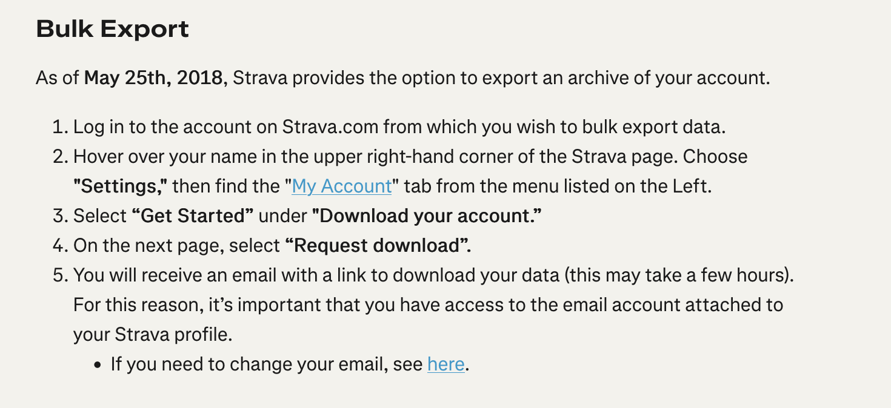

# Flow

This is the desired flow for frontend & backend working together. Add some logging to backend at each stage.

## Homepage

The frontend should say: "Create a bumblebee map using the bulk export of your Strava data!"

<button>Begin</button>

When they click Begin, they walk through a flow of steps. There is a status indicator showing the progresion.

## Step 1: Download Bulk Data from Strava.

https://support.strava.com/en-us/articles/15401919-exporting-your-data-and-bulk-export

<button>Next</button>

## Step 2: Upload the bulk export zip file.

Present a button for user to select file.

<button>Submit</button>

Once they click submit, try running the backend code to parse the file into geoparquet. This should go into a tmp directory. When done, show a success button and activate the next button.

<button>Next</button>

### Step 3: Select area

Choose a city and a bounding box.

User can search for a city and adjust the bounding box to their liking.

<button>Next</button>

### Step 4: Identify activities

This does not require user input, it just shows a status indicator.

The backend code should use duckdb with geospatial extension to filter the activities in the geoparquet file to those that intersect with the bounding box. Also filter out activities that are not Activity Type = Ride.

### Step 5: Show map

For now, just show a final map which is all the activities in the bounding box. They should be bright orange on a dark background.
